# Milo AI

<p align="center">
  
</p>

**Milo AI** -- an AI coding assistant that runs as a VS Code extension, powered by LLMs. It can edit files, run terminal commands, use a browser, and extend itself via MCP tools -- all with human-in-the-loop approval for every action.

---

## Architecture Overview

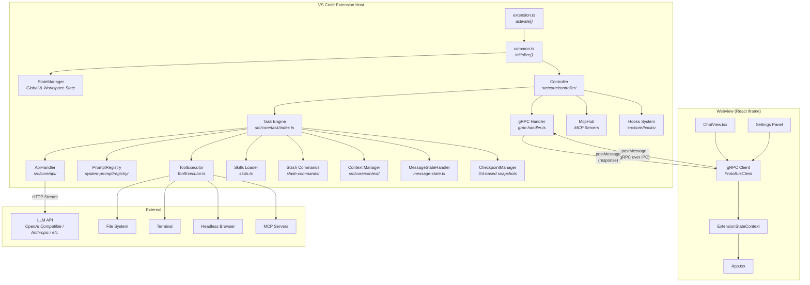

---

## Complete Message Flow -- When a User Sends a Message

### Phase 1: Webview to Extension

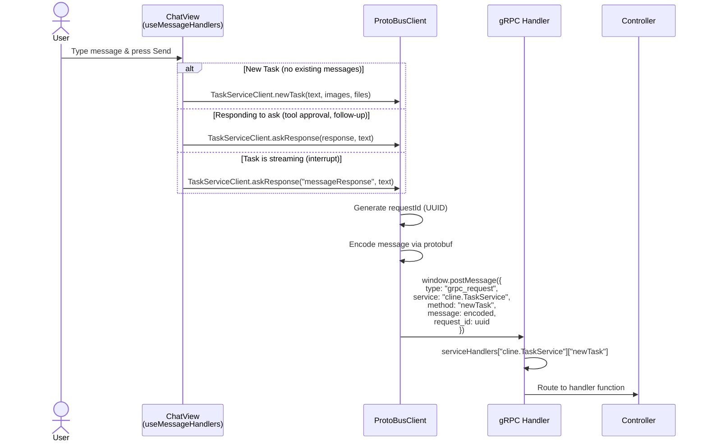

### Phase 2: Task Creation & Initialization

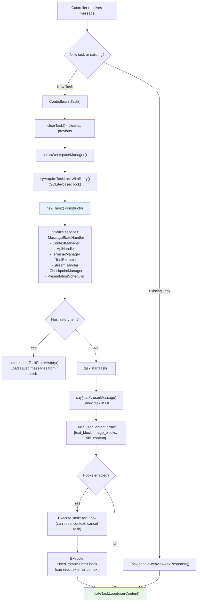

### Phase 3: Main Task Loop (initiateTaskLoop)

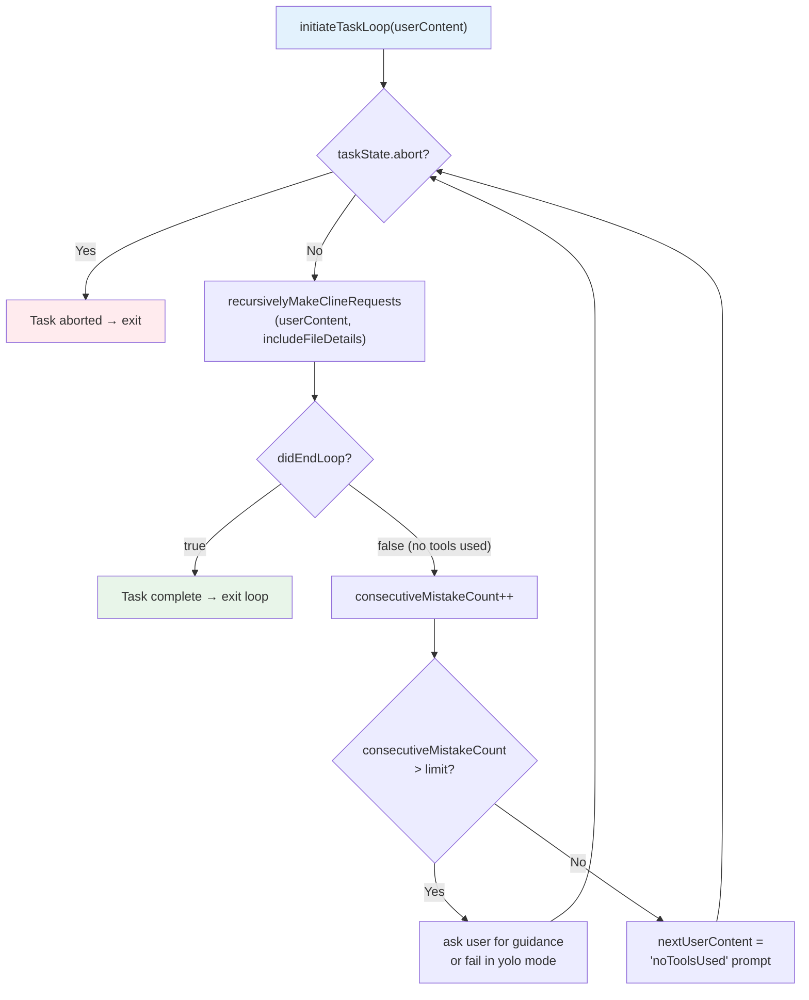

### Phase 4: recursivelyMakeClineRequests() - Detailed

```mermaid
flowchart TD
    START["recursivelyMakeClineRequests()"] --> VALIDATE["Phase 1: Validate<br/>Check abort flag, increment API counter"]

    VALIDATE --> CHECKPOINT{"First API request?"}
    CHECKPOINT -->|"Yes"| CP_CREATE["Phase 2: Create checkpoint<br/>say('checkpoint_created')<br/>Commit initial workspace snapshot"]
    CHECKPOINT -->|"No"| COMPACT_CHECK
    CP_CREATE --> COMPACT_CHECK

    COMPACT_CHECK --> COMPACT{"Phase 3: Context compaction needed?"}
    COMPACT -->|"Yes (auto-condense)"| COMPACT_DO["Use summarize_task<br/>Skip full context load"]
    COMPACT -->|"No"| LOAD_CTX

    COMPACT_DO --> API_REQ

    LOAD_CTX["Phase 4: Load Context"] --> MENTIONS["parseMentions()<br/>Resolve @file, @url, @folder"]
    MENTIONS --> SLASH_CMD["parseSlashCommands()<br/>Resolve /compact, /newtask, etc."]
    SLASH_CMD --> ENV["Load environment details:<br/>- Visible files<br/>- Workspace info<br/>- Focus chain<br/>- Custom rules (.milorules)"]

    ENV --> API_REQ["Phase 5: say('api_req_started')<br/>Show loading spinner"]

    API_REQ --> BUILD_PROMPT["Phase 6: Build System Prompt<br/>getSystemPrompt(promptContext)"]

    BUILD_PROMPT --> PROMPT_DETAIL["PromptRegistry selects variant:<br/>- generic (default)<br/>- next-gen (Claude 4, GPT-5)<br/>- xs (small/local models)<br/>- gpt-5, gemini-3, hermes, glm<br/><br/>PromptBuilder assembles:<br/>- System instructions<br/>- Tool specifications<br/>- Custom rules<br/>- Skills & capabilities<br/>- Browser/MCP instructions"]

    PROMPT_DETAIL --> CREATE_STREAM["Phase 7: Create API Stream<br/>api.createMessage(systemPrompt,<br/>  conversationHistory, tools)"]

    CREATE_STREAM --> STREAM_LOOP["Phase 8: Stream Processing Loop<br/>(see next diagram)"]

    STREAM_LOOP --> POST_STREAM["Phase 9: After stream<br/>- Finalize usage metrics<br/>- Update api_req_started with costs<br/>- Save to disk"]

    POST_STREAM --> TOOL_EXEC["Phase 10: Tool Execution Loop<br/>(see tool execution diagram)"]

    TOOL_EXEC --> RETURN{"Return didEndLoop"}

    style START fill:#e3f2fd
    style STREAM_LOOP fill:#fff3e0
    style TOOL_EXEC fill:#fce4ec
```

### Phase 5: Stream Processing Loop

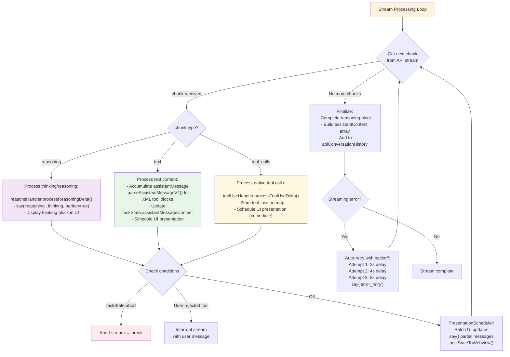

### Phase 6: Tool Execution

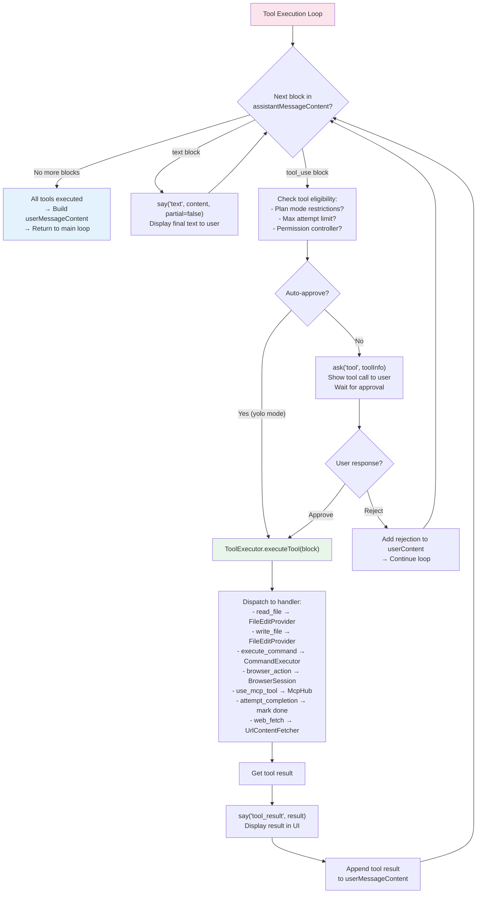

---

## Session & Conversation Management

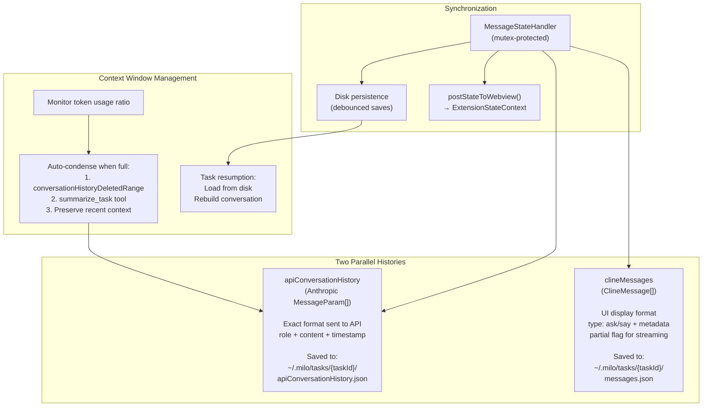

---

## Thinking / Reasoning Flow

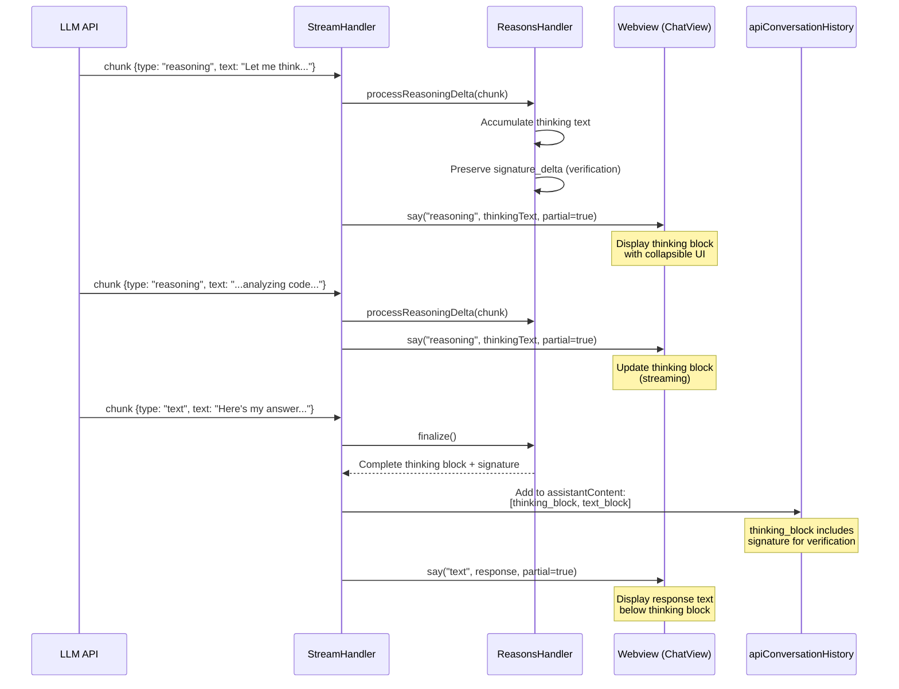

---

## Error Handling & Retry Flow

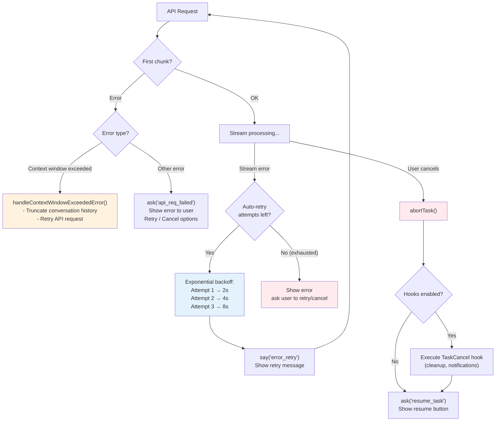

---

## Checkpoint System

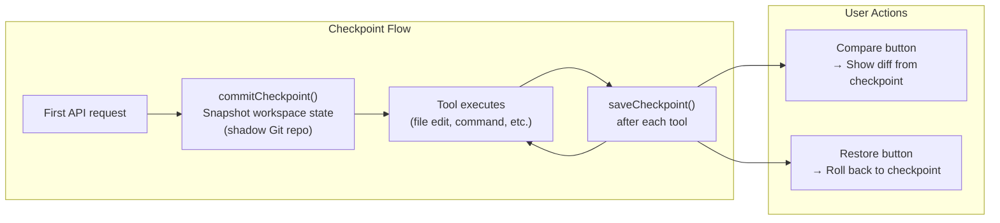

---

## gRPC Communication Layer

The Webview and Extension communicate via a gRPC-like protocol over `postMessage`:

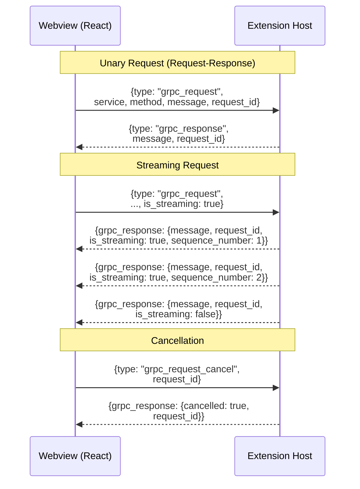

### Key Services

| Service | Proto File | Purpose |
|---------|-----------|---------|
| `ChatService` | `proto/cline/task.proto` | Send/receive messages, create tasks |
| `StateService` | `proto/cline/state.proto` | Read/write extension state & settings |
| `FileService` | `proto/cline/file.proto` | File operations |
| `BrowserService` | `proto/cline/browser.proto` | Browser control |
| `AccountService` | `proto/cline/account.proto` | Authentication & accounts |
| `McpService` | `proto/cline/mcp.proto` | Manage MCP servers |
| `CommandsService` | `proto/cline/commands.proto` | VS Code commands |

---

## Skill / Slash Command Flow

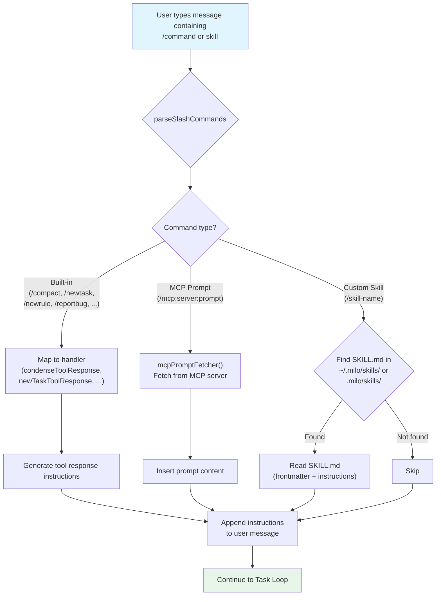

### Skill Discovery

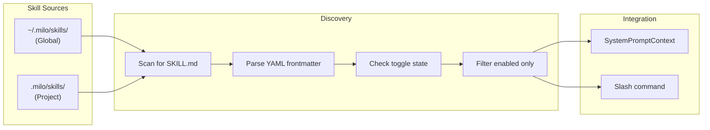

---

## Hooks System

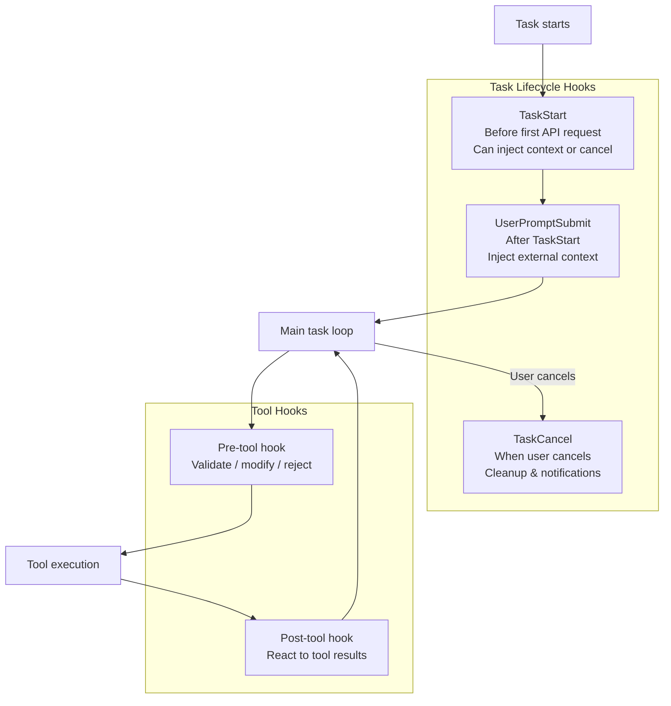

---

## Key Directories

```
src/
  extension.ts              # VS Code entry point
  common.ts                 # Platform-agnostic init
  core/
    controller/             # Central orchestrator
      index.ts              # Controller class
      grpc-handler.ts       # gRPC routing
      state/                # State update handlers
    task/
      index.ts              # Task engine (main loop ~3700 lines)
      TaskState.ts          # Task state management
      ToolExecutor.ts       # Tool dispatch & execution
      tools/handlers/       # Individual tool handlers
      message-state.ts      # Dual history sync (API + UI)
      TaskPresentationScheduler.ts  # Batched UI updates
    prompts/
      system-prompt/
        registry/           # PromptRegistry, PromptBuilder, ClineToolSet
        variants/           # Model-specific configs (generic, next-gen, xs, ...)
        components/         # Reusable prompt sections
        tools/              # Tool definitions per model family
      commands.ts           # Slash command prompts
    api/                    # API provider handlers
    context/                # Context management & tracking
    hooks/                  # Hook system (TaskStart, Cancel, etc.)
    slash-commands/          # Slash command parsing
  shared/
    proto/                  # Generated proto types
    api.ts                  # Provider & model definitions
    net.ts                  # Proxy-aware fetch
  generated/                # Auto-generated gRPC code
proto/                      # Proto definitions (.proto files)
webview-ui/
  src/
    App.tsx                 # React entry point
    components/chat/        # Chat UI (ChatView, ChatRow, InputSection)
    services/grpc-client.ts # Generated service clients
    context/                # ExtensionStateContext
cli/                        # CLI (React Ink) terminal UI
```

---

## License

[Apache 2.0 © 2026 Milo AI Bot Inc.](./LICENSE)
