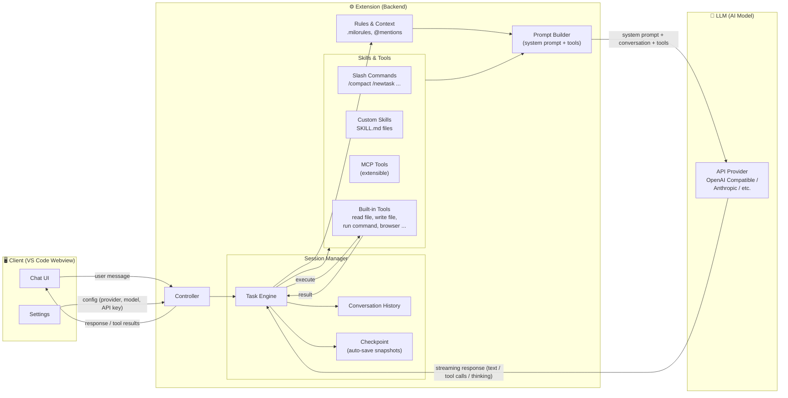
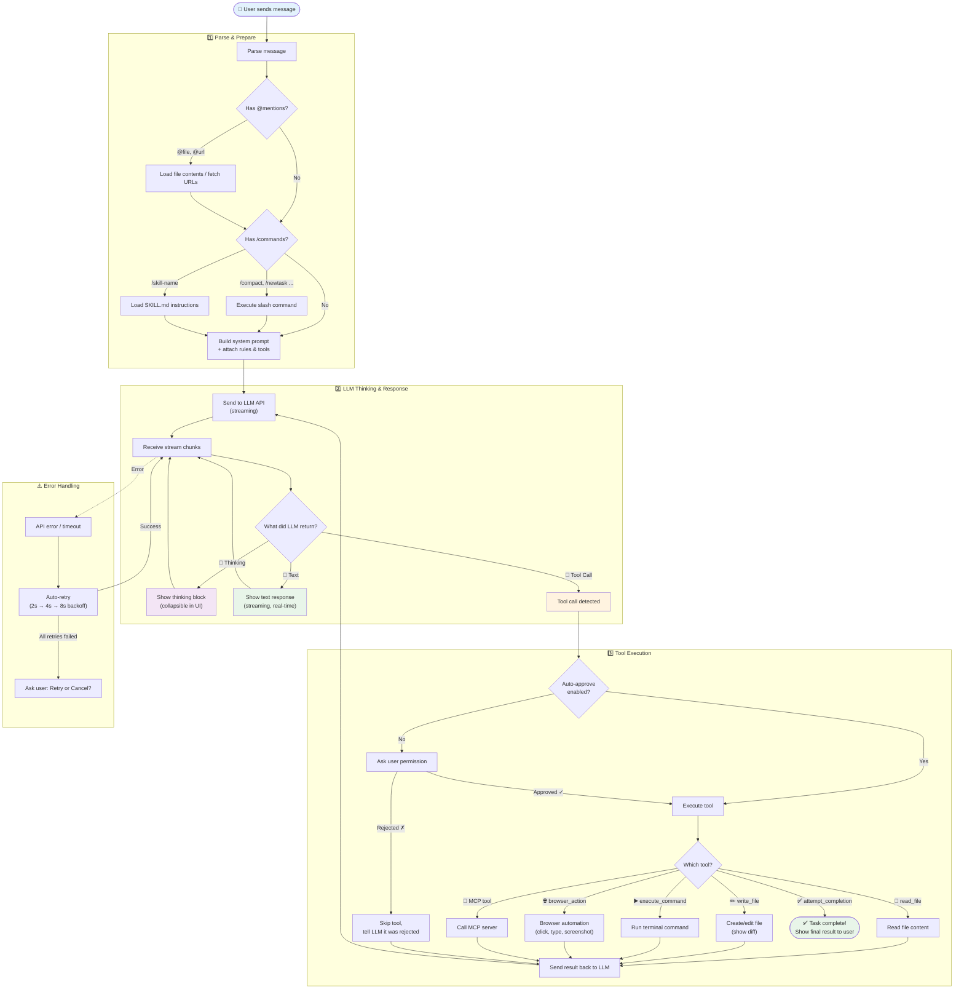

# Milo AI

<p align="center">
  
</p>

**Milo AI** -- an AI coding assistant that runs as a VS Code extension, powered by LLMs. It can edit files, run terminal commands, use a browser, and extend itself via MCP tools.

---

## Installation

### Prerequisites

- [VS Code](https://code.visualstudio.com/) version 1.84 or higher
- An LLM API endpoint (OpenAI Compatible, Anthropic, etc.)

### Install from VSIX

1. Download the latest `.vsix` file from the 
2. Open VS Code
3. Press `Ctrl+Shift+P` (or `Cmd+Shift+P` on Mac) → type **"Install from VSIX"**
4. Select the downloaded `milo-ai-x.x.x.vsix` file
5. Reload VS Code when prompted

**Or install via terminal:**

### First-time Setup

After installation, Milo AI will open a welcome screen:

1. Enter your **API Base URL** (e.g. `https://api.inferx.x-or.cloud/v1`)
2. Enter your **API Key**
3. Click **Get Started**

> Default model is `gemma4`. You can change the provider, model, and other settings later in Settings (gear icon).


---

## Flow 1: Overall Architecture

How the Client (VS Code UI), Extension (brain), and LLM (AI model) work together:



**How it works:**

1. **User sends a message** in the Chat UI
2. **Controller** creates or resumes a **Session** (Task)
3. Session loads **Rules** (from .milorules files) and available **Skills**
4. **Prompt Builder** assembles everything into a system prompt
5. Sends to **LLM** via API (streaming)
6. LLM responds with **text**, **tool calls**, or **thinking**
7. If LLM requests a tool → Extension **executes it** → sends result back to LLM
8. Loop continues until LLM says "done"
9. Final response shown to user

---

## Flow 2: Message Processing & Execution

What happens step-by-step when you send a message:



**The loop explained simply:**

1. **Parse** — resolve @mentions and /commands in the message
2. **Send to LLM** — stream the response in real-time
3. **LLM responds** with one of:
   - **Thinking** → shown as collapsible block (reasoning process)
   - **Text** → shown directly (streaming, word by word)
   - **Tool call** → extension executes the tool, sends result back to LLM
4. **Repeat** — LLM keeps calling tools until the task is done
5. **Done** — LLM calls `attempt_completion` to finish

---

## Key Directories

```
src/
  core/
    controller/        # Receives messages, manages sessions
    task/              # Task engine (main loop, tool execution)
    prompts/           # System prompt builder (per model variant)
    api/               # API provider handlers
    context/           # Rules, file tracking, mentions
    hooks/             # Lifecycle hooks (TaskStart, Cancel)
    slash-commands/     # Built-in slash command handlers
  shared/
    api.ts             # Provider & model definitions
    net.ts             # Proxy-aware networking
proto/                 # gRPC protocol definitions
webview-ui/            # React frontend (Chat UI, Settings)
cli/                   # Terminal UI (React Ink)
```

---

## License

[Apache 2.0 © 2026 Milo AI Bot Inc.](./LICENSE)
