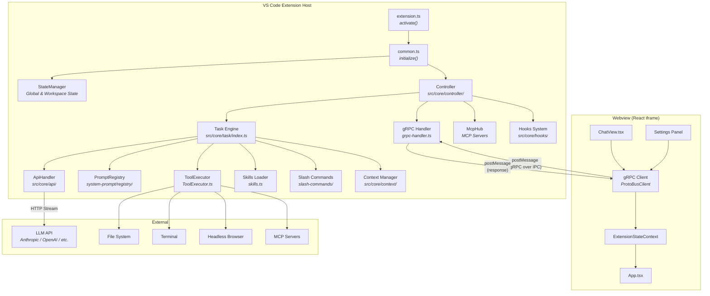
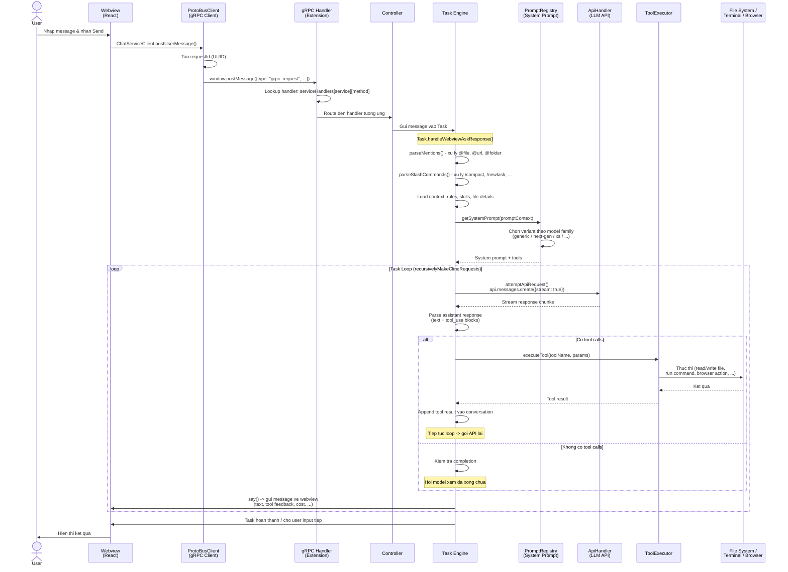
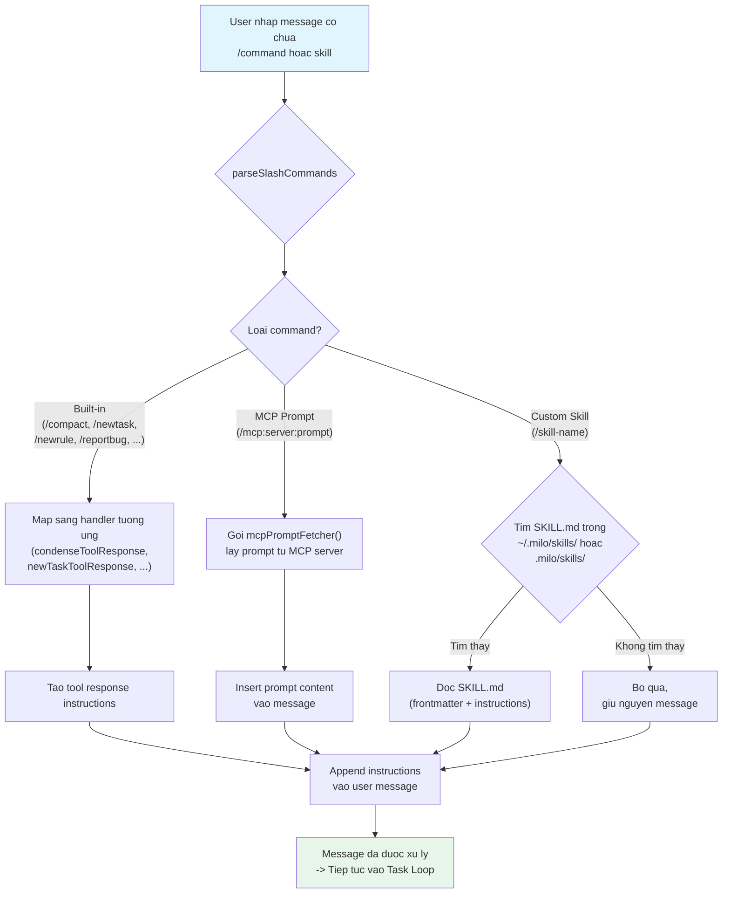
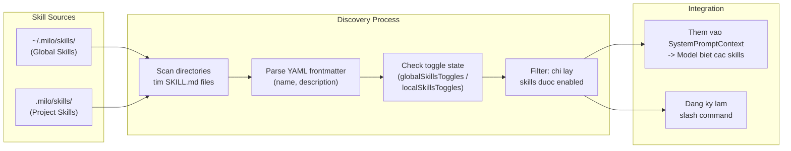
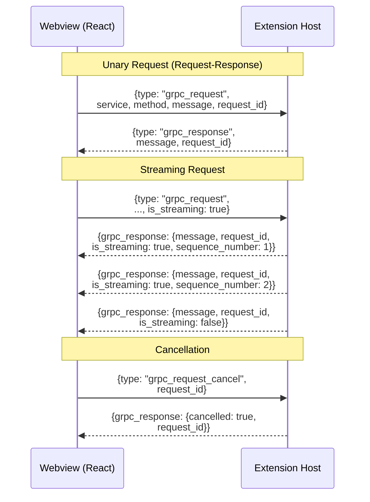
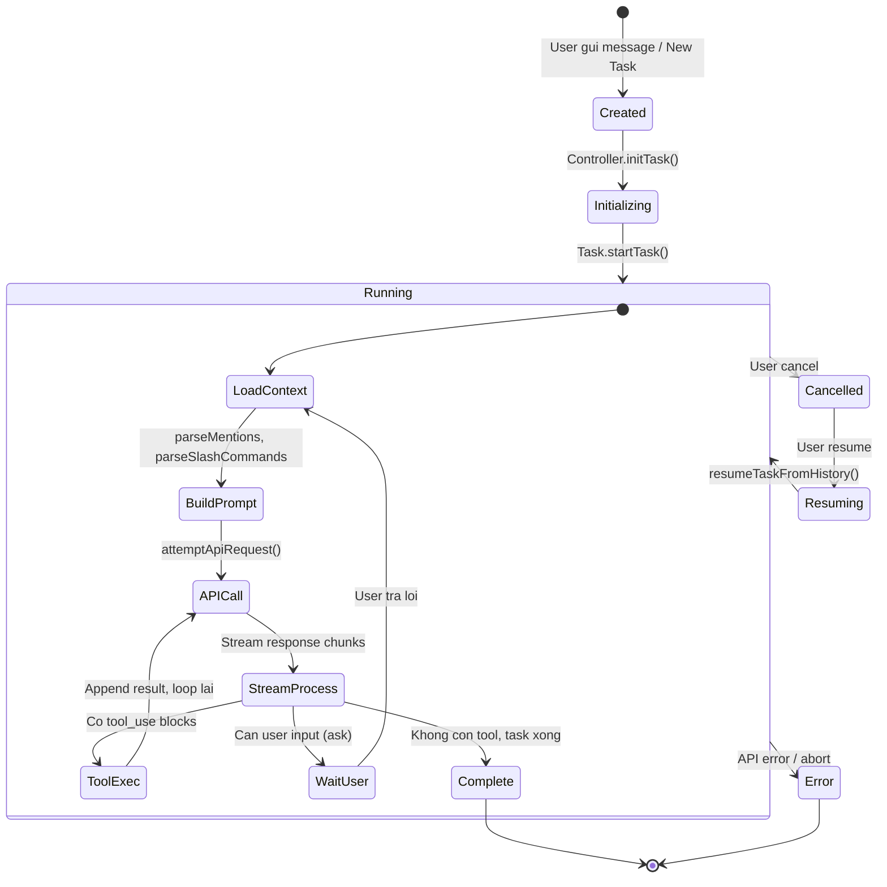

# Milo AI

<p align="center">
  
</p>

<div align="center">
<table>
<tbody>
<td align="center">
<a href="https://marketplace.visualstudio.com/items?itemName=x-or-cloud.claude-dev" target="_blank"><strong>Download on VS Marketplace</strong></a>
</td>
<td align="center">
<a href="https://discord.gg/milo-ai" target="_blank"><strong>Discord</strong></a>
</td>
<td align="center">
<a href="https://docs.milo-ai.bot/getting-started/for-new-coders" target="_blank"><strong>Getting Started</strong></a>
</td>
</tbody>
</table>
</div>

Meet **Milo AI** -- an AI coding assistant that runs as a VS Code extension, powered by LLMs. It can edit files, run terminal commands, use a browser, and extend itself via MCP tools -- all with human-in-the-loop approval.

---

## Architecture Overview



---

## Message Flow -- Khi user gui 1 message

Luong chi tiet khi user nhap message trong chat va gui di:



---

## Skill / Slash Command Flow

Luong chay khi user dung skill (vd: `/compact`, `/newtask`) hoac custom skill tu `SKILL.md`:



### Chi tiet Skill Discovery



---

## gRPC Communication Layer

Webview va Extension giao tiep qua protocol giong gRPC, chay tren `postMessage`:



### Proto Services

| Service | File | Chuc nang |
|---------|------|-----------|
| `ChatService` | `proto/cline/task.proto` | Gui/nhan message, tao task |
| `StateService` | `proto/cline/state.proto` | Doc/ghi extension state, settings |
| `FileService` | `proto/cline/file.proto` | Thao tac file |
| `BrowserService` | `proto/cline/browser.proto` | Dieu khien browser |
| `AccountService` | `proto/cline/account.proto` | Auth, tai khoan |
| `McpService` | `proto/cline/mcp.proto` | Quan ly MCP servers |
| `CommandsService` | `proto/cline/commands.proto` | VS Code commands |

---

## Task Lifecycle



---

## Key Directories

```
src/
  extension.ts              # VS Code entry point
  common.ts                 # Platform-agnostic init
  core/
    controller/             # Central orchestrator
      index.ts              # Controller class
      grpc-handler.ts       # gRPC routing
      state/                # State update handlers
    task/
      index.ts              # Task engine (main loop)
      TaskState.ts          # Task state management
      ToolExecutor.ts       # Tool execution
      tools/handlers/       # Individual tool handlers
      message-state.ts      # Message state sync
    prompts/
      system-prompt/
        registry/           # PromptRegistry, PromptBuilder
        variants/           # Model-specific configs
        components/         # Reusable prompt sections
        tools/              # Tool definitions
      commands.ts           # Slash command prompts
    api/                    # API provider handlers
    context/                # Context management
    hooks/                  # Hook system
    slash-commands/          # Slash command parsing
  shared/
    proto/                  # Generated proto types
    api.ts                  # Provider & model definitions
    net.ts                  # Proxy-aware fetch
  generated/                # Auto-generated gRPC code
proto/                      # Proto definitions
webview-ui/
  src/
    App.tsx                 # React entry
    components/chat/        # Chat UI
    services/grpc-client.ts # Generated service clients
    context/                # State context
cli/                        # CLI (React Ink) interface
```

---

## Features

### Use any API and Model

Milo AI supports API providers like OpenRouter, Anthropic, OpenAI, Google Gemini, AWS Bedrock, Azure, GCP Vertex, Cerebras and Groq. You can also configure any OpenAI compatible API, or use a local model through LM Studio/Ollama.

### Run Commands in Terminal

Milo AI can execute commands directly in your terminal and receive the output -- installing packages, running build scripts, deploying applications, managing databases, and executing tests.

### Create and Edit Files

Milo AI can create and edit files directly in your editor, presenting you a diff view of the changes. It also monitors linter/compiler errors so it can fix issues on its own.

### Use the Browser

Milo AI can launch a browser, click elements, type text, and scroll, capturing screenshots and console logs at each step for interactive debugging and end-to-end testing.

### MCP Tools

Milo AI can extend its capabilities through custom MCP tools. Ask Milo AI to "add a tool" and it will create and install MCP servers tailored to your workflow.

### Checkpoints

The extension takes a snapshot of your workspace at each step. Use 'Compare' to see diffs and 'Restore' to roll back.

---

## Contributing

Start with our [Contributing Guide](CONTRIBUTING.md). Join [Discord](https://discord.gg/milo-ai) (`#contributors` channel).

## Enterprise

Get the same Milo AI experience with enterprise-grade controls: SSO (SAML/OIDC), global policies and configuration, observability with audit trails, private networking (VPC/private link), and self-hosted or on-prem deployments. Learn more at our [enterprise page](https://milo-ai.bot/enterprise) or [talk to us](https://milo-ai.bot/contact-sales).

## License

[Apache 2.0 © 2026 Milo AI Bot Inc.](./LICENSE)
