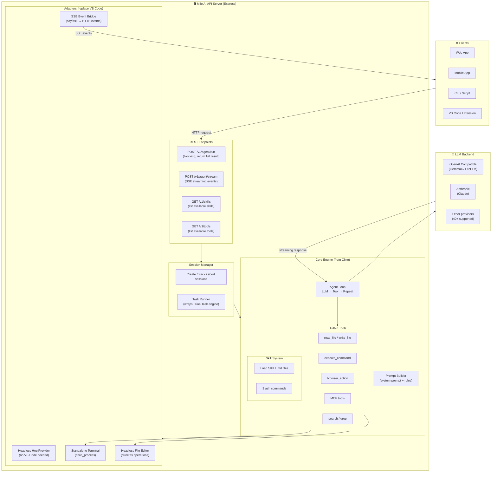
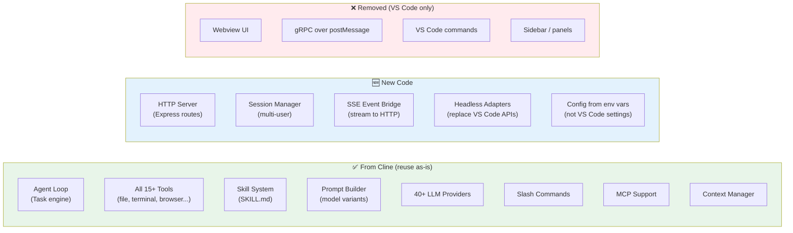

# Milo AI API Server

Standalone API server exposing all Milo AI agent capabilities (tools, skills, agent loop) via REST API.

---

## Architecture



---

## What comes from Cline vs What's new



---

## API Usage

### Run a task (blocking)

```bash
curl -X POST http://localhost:3000/v1/agent/run \
  -H "Content-Type: application/json" \
  -d '{
    "task": "Create a hello world Express server in /tmp/demo",
    "apiKey": "sk-xxx",
    "modelId": "gemma4"
  }'
```

Response:
```json
{
  "sessionId": "abc-123",
  "status": "completed",
  "result": "Created Express server with index.js and package.json",
  "events": [...],
  "usage": { "inputTokens": 1200, "outputTokens": 800, "turns": 3 }
}
```

### Run a task (streaming)

```bash
curl -X POST http://localhost:3000/v1/agent/stream \
  -H "Content-Type: application/json" \
  -d '{
    "task": "Fix the bug in src/utils.ts"
  }'
```

Response (SSE):
```
event: thinking
data: {"text": "Let me read the file first..."}

event: tool_call
data: {"tool": "read_file", "params": {"path": "src/utils.ts"}}

event: tool_result
data: {"tool": "read_file", "result": "file contents..."}

event: text
data: {"text": "I found the bug. The issue is..."}

event: tool_call
data: {"tool": "write_file", "params": {"path": "src/utils.ts", "content": "..."}}

event: completion
data: {"result": "Fixed the null check bug in parseConfig()"}
```

### List skills

```bash
curl http://localhost:3000/v1/skills
```

### List tools

```bash
curl http://localhost:3000/v1/tools
```

---

## Configuration

All config via environment variables:

| Variable | Default | Description |
|----------|---------|-------------|
| `MILO_API_PORT` | `3000` | Server port |
| `MILO_API_HOST` | `0.0.0.0` | Server host |
| `MILO_WORKSPACE_DIR` | `cwd` | Default working directory |
| `MILO_DATA_DIR` | `~/.milo/data` | Data storage directory |
| `MILO_API_PROVIDER` | `openai` | Default LLM provider |
| `MILO_API_BASE_URL` | `https://api.inferx.x-or.cloud/v1` | Default API base URL |
| `MILO_API_KEY` | `` | Default API key |
| `MILO_MODEL_ID` | `gemma4` | Default model |
| `MILO_AUTO_APPROVE` | `true` | Auto-approve all tools |
| `MILO_MAX_TURNS` | `50` | Max agent loop turns |

---

## Project Structure

```
milo-ai-api/
  src/
    index.ts                    # Entry point, start server
    server.ts                   # Express app setup + routes
    config.ts                   # Load config from env vars

    routes/
      agent.ts                  # POST /v1/agent/run & /stream
      skills.ts                 # GET /v1/skills
      tools.ts                  # GET /v1/tools

    session/
      session-manager.ts        # Track active sessions
      task-runner.ts            # Wrap Cline Task engine

    adapters/
      host-provider-api.ts      # Headless HostProvider (no VS Code)
      host-bridge-noop.ts       # No-op VS Code service stubs
      sse-event-bridge.ts       # Bridge Task events → SSE stream

    types/
      api-types.ts              # Request/Response types

  # Imports from ../milo-ai/src/ (shared codebase):
  #   core/task/          → Agent loop
  #   core/api/           → LLM providers
  #   core/prompts/       → Prompt builder
  #   core/context/       → Skills, rules
  #   shared/             → Types, tools
```
